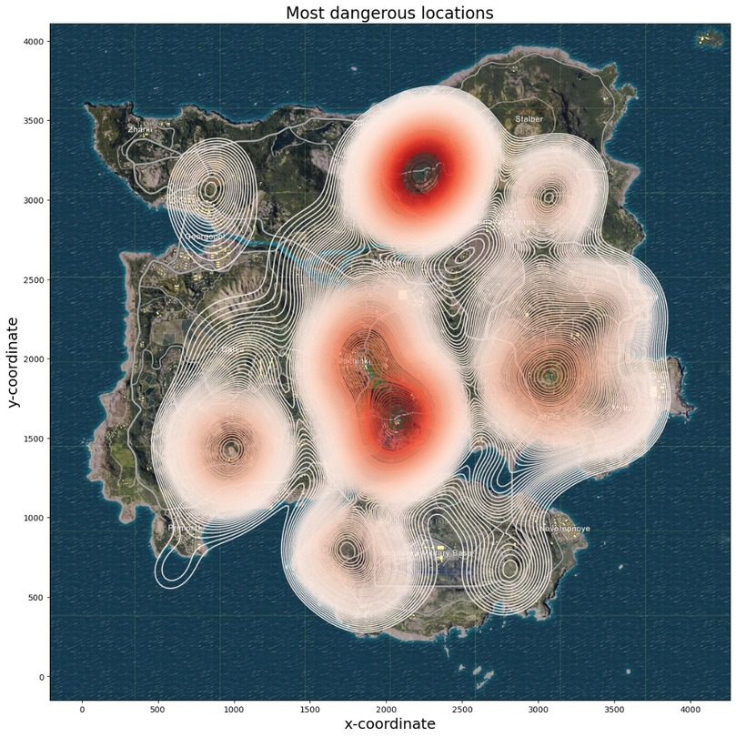
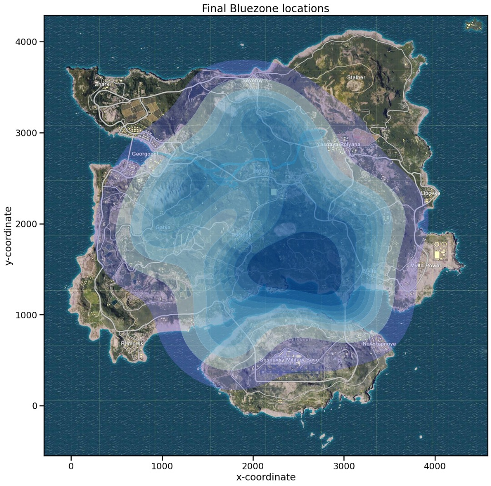
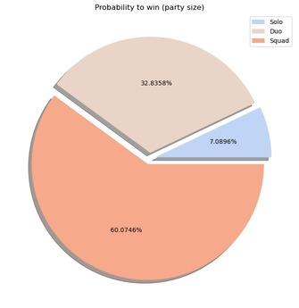
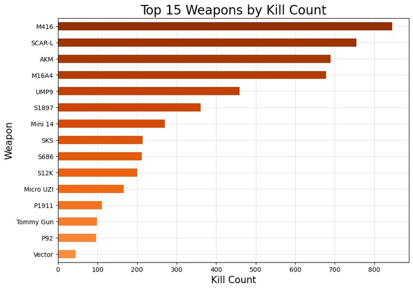

# PUBG Survival Analytics: From Raw Data to Playable Insights

**One-liner:** First-year data science project turning two messy PUBG datasets into clear tips for beginners-party size, safer early-game landings, weapons, assisting teammates, movement choices, and bluezone timing.

## What’s here
- `data/final_kill_match_stats.csv`
- `data/final_agg_match_stats.csv`
- `reports/Data Pre-processing.html` – how the raw data was cleaned and reduced
- `reports/Data Analysis and Visualisation.html` – analysis & charts (KDE maps, etc.)

## Highlights
- Focus on **Erangel** for consistent comparisons  
- Practical cleaning: reduction, feature selection, date/unit fixes, missing values  
- Visual insights that translate to simple survival tips

## Getting started
Download this repo and open the HTML reports in your browser for a guided tour of the preprocessing and analysis.

## Results (visuals)

**Most dangerous early-game locations (Erangel)**  

**Bluezone progression**  

**Probability to win vs. party size**  

**Top 15 weapons (sample)**  

## Author
Lee Shan Yan 
